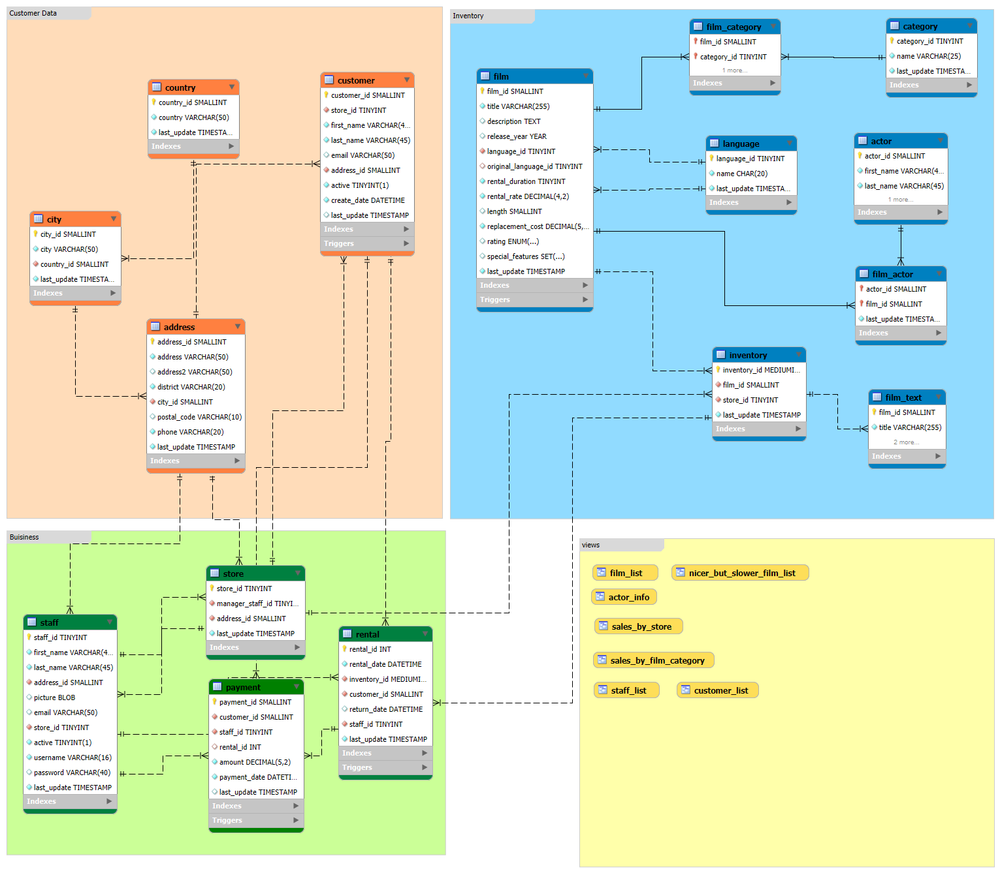

# DATABASE



In this case our database includes **16 related tables**, containing information about:

- 🟠 **Customers** (`Name`, `Address`, etc.)
- 🟢 **Business** (`Staff`, `Rentals`, etc.)
- 🔵 **Inventory** (`Films`, `Categories`, etc.)

We’ll start by using MySQL to explore **individual tables**, then discuss table relationships and multi-table joins later in the course.

---

> _**Tip:** You can view the full Entity Relationship Diagram (ERD) above to understand how tables connect, including foreign keys and data groupings._

---


## 📝 Table Descriptions

| Area        | Tables                                                     |
|-------------|------------------------------------------------------------|
| Customers   | `customer`, `address`, `city`, `country`                   |
| Business    | `staff`, `store`, `payment`, `rental`                      |
| Inventory   | `film`, `category`, `film_category`, `language`, `actor`, `film_actor`, `film_text`, `inventory` |
| Views       | `film_list`, `actor_info`, `sales_by_store`, ...           |

---
## 🛠️ Setup the Database

To create and populate the database, run the following file:

```bash
create_mavenmovies.sql
